---
---

#服务器

# 如何远程使用自动化系的服务器进行代码的编写和调试。

讲的是怎么用，协议的原理不在考虑范围之内。
# 一.基本概念

首先需要对服务器有一个概念。服务器就是一台远程的电脑，深度学习的各种程序对显卡和内存的需求比较高，一般自己的笔记本无法满足。所以需要用实验室的高配置的电脑。服务器只有一台，所以不可能每个人都直接操作那台机器，需要用远程连接的方式来使用。

可用的服务器有两台

||IP|用户名|密码|显卡和内存
---|---|---|---|---|
Server 1|192.168.1.8 |automation|student|1080ti\*4 32G内存|
Server 2|192.168.1.5 |lthpc|cup-auto|2080ti\*4 96G内存|

以上IP只能在网络处于自动化系的局域网环境下时才能够连接使用[^1]。

[^1]: 如果不在局域网内连接的话,需要使用转发,通过转发连接的ssh配置如下

	||host|HostName|username|password|port
	---|---|---|---|---|
	Server 1|ip.gitpassword.com |automation|student|8024|
	Server 2|ip.gitpassword.com |lthpc|cup-auto|6000|
		

同时ssh ftp这些连接方式都需要IP。

其次要对三个协议有一个概念。
## 1. ssh

通过ssh对服务器的bash终端进行操作。简单理解为控制机器用。
## 2. ftp

 通过ftp协议实现服务器与客户端机器之间的文件传输。简单理解为拷贝文件用。Sftp则是在ftp的基础上有一个加密的过程了，更安全，现在两个服务器用的都是sftp了。
## 3. x11

 在写代码时候有一些图形界面需要在客户端机器上显示，比如python的plt.show(),这些图形界面就通过X协议进行转发。简单理解为显示GUI用。

有一个软件可以实现三种连接，MobaXterm,下载地址：[https://mobaxterm.mobatek.net/](https://mobaxterm.mobatek.net/) 

软件支持各种协议的连接，根据自己的需要选择就可以了。以下ssh和sftp连接的示例都使用MobaXterm软件。
# 二 使用ssh远程连接服务器的终端

以ssh连接为例： 

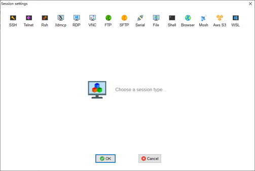

1. 点击session，出现下图创建会话的页面。

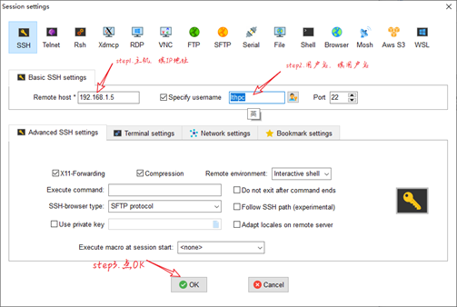

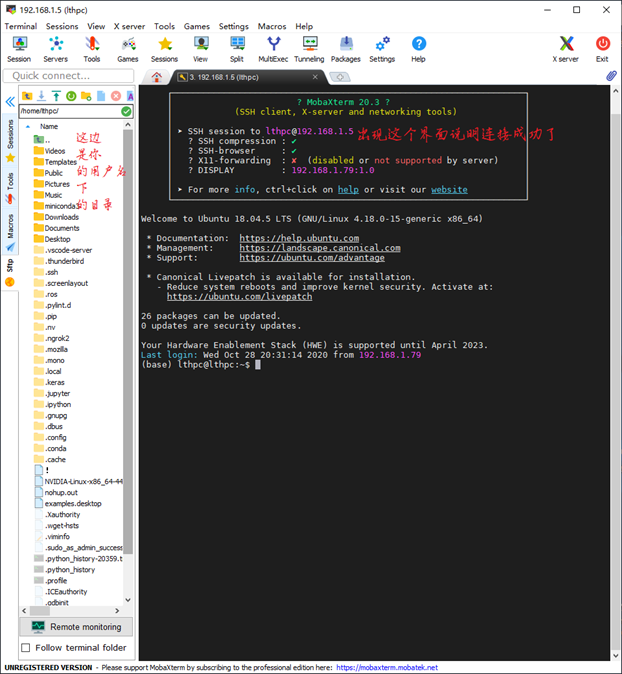

出现上图所示的界面就说明ssh连接成功了，这里就相当你已经可以操作远程服务器的bash终端了，在这个界面输入你想输入的命令，就能够控制远程服务器。

# 三.使用sftp进行文件传输

写代码之前肯定得把自己机器上已有的代码传上去，这里就用sftp。注意用ftp是连不上的，因为服务器上开的不是ftp服务，是sftp服务。

1.工作目录：

因为大家都需要使用服务器，为了不让使用引起混乱，每个人需要在固定的目录下建一个文件夹，例如我自己的文件夹路径就是：/media/lthpc/hd\_auto/Liu/xiaobingbiao/，你想要使用就在Liu这个目录下新建你自己的文件夹就可以了。

2.文件传输演示：

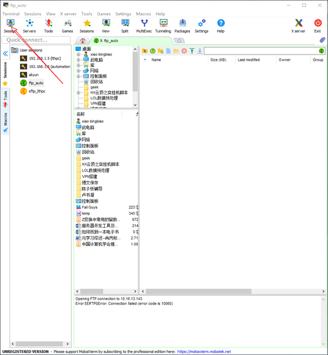

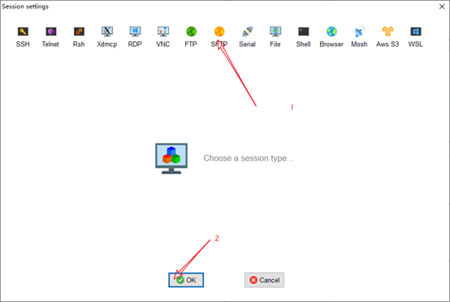

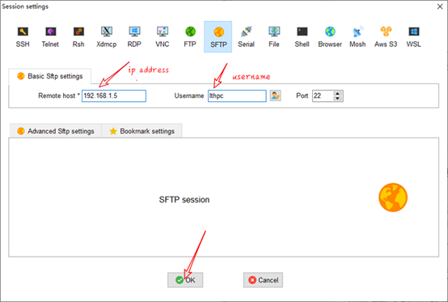

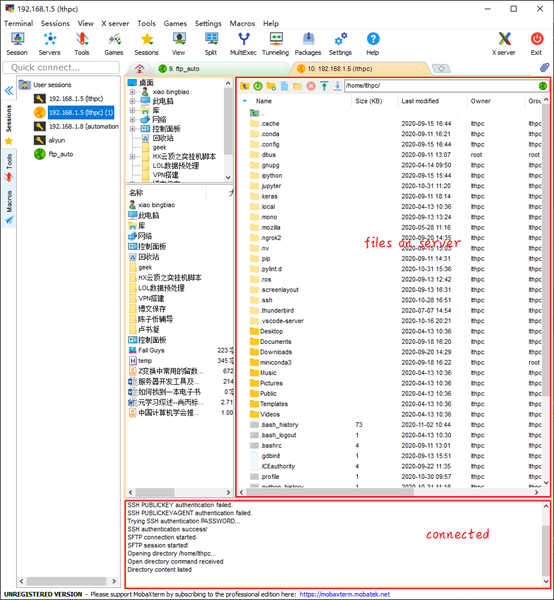

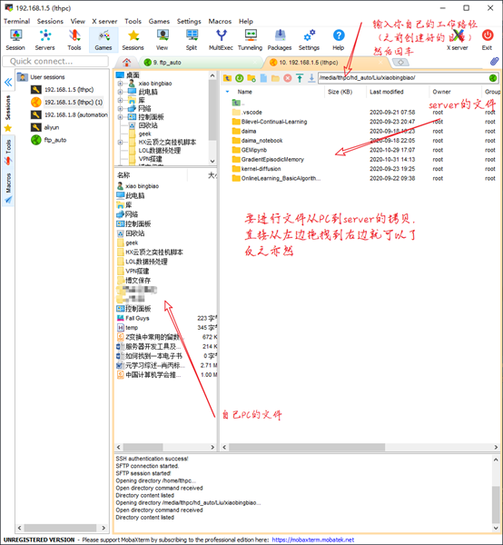
# 四.写代码调代码

关于vscode如何配置python环境（百度一下教程即可）以及python编程环境的管理（即anaconda的使用）知识，默认为阅读本文档的前置知识，请自行学习，不再赘述。本文档只涉及和远程服务器相关的东西。

我们使用的代码编辑器是vscode（下载地址：[https://code.visualstudio.com/](https://code.visualstudio.com/) ）

这个编辑器有丰富的插件，所以有丰富的功能。

1.使用vscode ssh对远程服务器进行ssh连接

Vscode基本上所有的功能都以插件的形式进行实现。

1.先下载 Remote-SSH插件使vscode支持ssh连接 

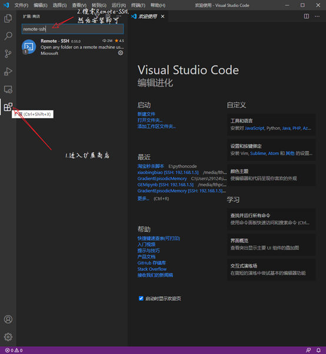
安装完成之后。

Ctrl+shift+p 进入vscode的命令模式，输入ssh

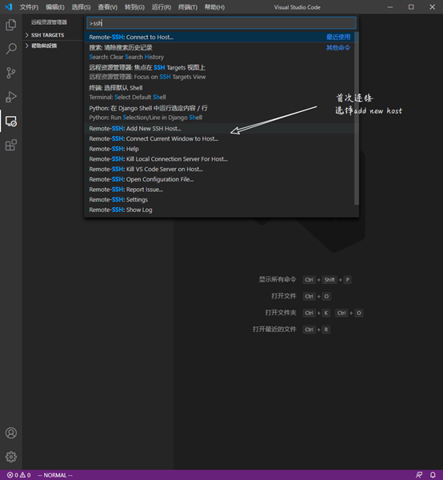
输入ssh [lthpc@192.1.68.1.5](mailto:lthpc@192.1.68.1.5) 回车，配置文件选默认的即可。添加主机之后即可在远程资源管理器中看到添加的主机了。如下图：

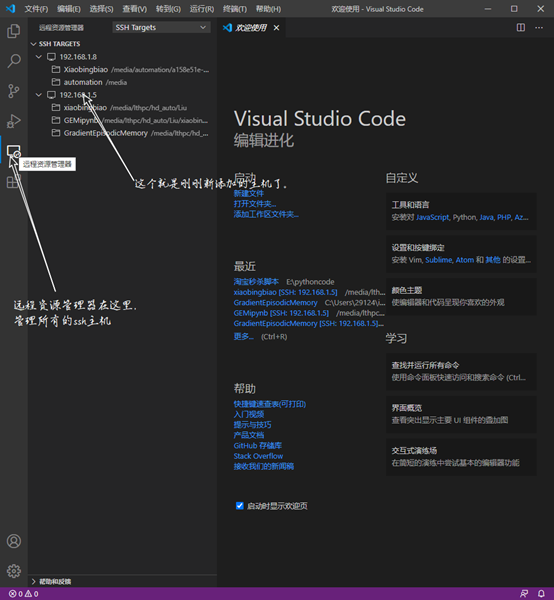
右键点击相应的主机就可以连接了，选择新窗口或者这个窗口随意。

之后要输入密码就输入密码，第一次连接可能要花比较久的时间，耐心一点即可。

连接成功之后，打开自己想要的文件夹或者代码文件，就可以进行编写和调试了。此时所有的文件的修改和python的环境使用的都是远程服务器的，自己的PC只是一个客户端。

附：免密连接。

2.vscode配置能够显示plot图片

# 五.ubuntu进程管理常用命令

Shell命令有的是操作系统自带的命令，有的是应用程序提供的bash命令。并不是只有一个标准的。

`nvidia-smi`：查看显存使用情况;`watch \-n 0.1 nvidia-smi`：动态显示显存使用情况

查看机器内存使用情况:`free` 动态显示内存使用情况：`watch -n 0.1 free -h `

`ps -aux` : 查看所有的进程 `ps -aux | grep python`：筛选出和python有关的进程

`kill pid`：杀死进程;`kill -9 pid`:(相应的进程ID强制杀死

# 六.screen后台挂起进程（后台挂起有没有更好的办法呢？？据说nohup直接就可以挂起了。）

Screen 是一个多重视窗管理程序，提供了一个后台挂起进程的方法。当时是因为一个显示器没办法运行多个窗口而开发出来的一个程序，让服务器多开几个进程，来模拟出多个窗口。

Screen可以创建多个会话，会话下面可以创建多个视窗，方便多个后台进程的运行。

1.直接输入`screen -S name` 创建一个名字为name的screen会话。

2`ctrl+a+c`:创建一个新窗口。

创建若干个新窗口之后，

`ctrl+a+n`:切换到下一个窗口，

`ctrl+a+p`:切换到上一个窗口.（注意，窗口和会话是两个不同的概念，窗口是会话的子集。）

在某个窗口中敲`exit`即可退出当前窗口，当把所有的窗口都退出之后，session就结束了。`Screen -ls `不再能够查看。 

Ctrl+a+w显示所有存在的窗口

之后便可以在不同的窗口中运行相同的程序。

3.暂离当前会话，ctrl+a+d，这个是最核心的功能，我们需要的就是人暂离，而程序继续运行。 

4.暂离之后重新连接至会话，`screen -r name`

5想结束某个会话有两种方法，直接杀死进程`kill id`，或者`screen -S name -X quit`

`screen -ls `:查看所有的会话（session）列表。